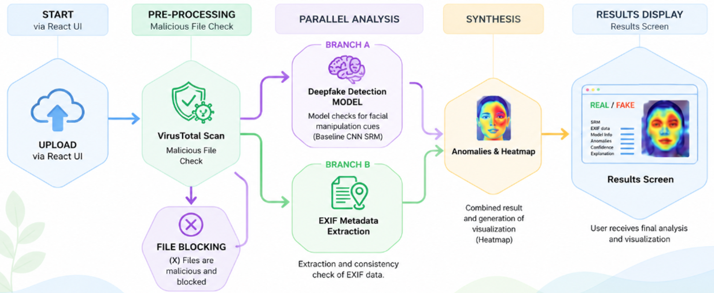

# 👁️ RealEyes

> **An Explainable AI Platform for Deepfake Image Detection**

---

## Overview

**RealEyes** is an explainable AI-powered platform for detecting AI-generated and manipulated images.

Unlike conventional deepfake detectors that simply classify images as *Real* or *Fake*, RealEyes combines multiple complementary analysis techniques into a unified forensic investigation platform.

The system integrates deep learning, image forensics, metadata analysis, cybersecurity validation, and visual explanations to provide reliable and interpretable results.

The project was developed as part of a Software Engineering capstone project at **Shamoon College of Engineering (SCE)**.

---

## Why RealEyes?

Recent advances in **GAN** and **Diffusion** models have dramatically improved the realism of synthetic images.

Although many deep learning detectors achieve high accuracy on the datasets used during training, they often struggle to generalize to previously unseen datasets.

RealEyes addresses this challenge by focusing on:

- Cross-dataset generalization
- Explainable AI
- Digital image forensics
- Security-aware image validation
- Practical real-world deployment

---

## Key Features

- 🔍 Deepfake image detection
- 🔥 Grad-CAM visual explanations
- 📄 EXIF metadata extraction
- 🛡️ VirusTotal file security validation
- 📊 Prediction confidence score
- 🌍 Cross-dataset evaluation
- 💻 Modern React + Django web application

---

## Detection Pipeline

The following figure illustrates the complete RealEyes forensic pipeline, from image upload and preprocessing to multi-model analysis, prediction, and explainability.

  

---

## AI Models

RealEyes evaluates and compares several complementary deep learning architectures.

| Model | Purpose |
|--------|---------|
| CNN-SRM | Low-level forensic artifact detection |
| EfficientNetB0 | Semantic and texture analysis |
| ViT-Tiny | Vision Transformer baseline |
| Ensemble | Combines multiple model predictions |

Each architecture was evaluated independently and compared using identical experimental settings.

---

## Datasets

The project evaluates model robustness using more than **400,000 images** collected from four different datasets.

| Dataset | Description |
|----------|-------------|
| OpenForensics | GAN-generated facial images |
| CelebDF v2 | Face-swap video frames |
| CIFAKE | AI-generated synthetic images |
| CustomWar | Custom war-scene image dataset |

The datasets were selected to evaluate **cross-dataset generalization**, one of the primary research goals of the project.
