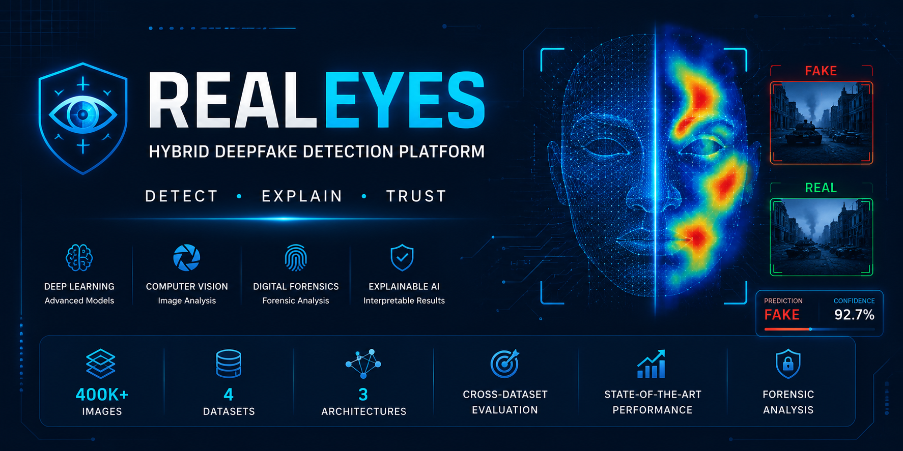
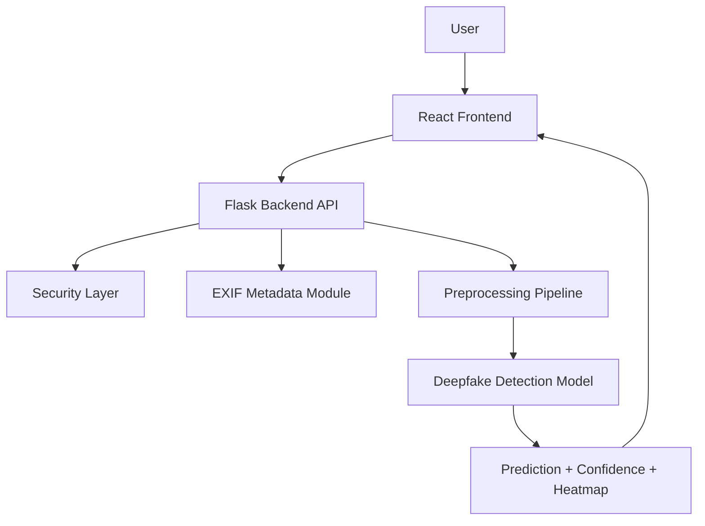

  

# 👁️ RealEyes

### Hybrid Deepfake Detection Platform

Detect • Explain • Trust

Deep Learning • Computer Vision • Digital Forensics • Explainable AI

 

---

## Overview

RealEyes is an end-to-end deepfake detection platform designed to identify AI-generated and manipulated images under real-world conditions.

Unlike traditional deepfake detectors that provide only a binary prediction, RealEyes combines multiple forensic and deep learning analysis techniques to deliver an explainable and trustworthy decision.

The platform integrates deep learning models, digital image forensics, metadata analysis, cybersecurity validation, and visual explanations into a single investigation pipeline.

---

## Why RealEyes?

Deepfake images generated by modern GAN and Diffusion models have become increasingly difficult to distinguish from authentic images.

Most existing detectors perform well only on the dataset on which they were trained, but experience a significant performance drop when evaluated on unseen datasets.

---

## Key Features

| Feature | Description |
|---|---|
| Image Upload | Upload an image and run an automated authenticity check |
| Real / Fake Prediction | Returns a clear classification result with confidence score |
| Grad-CAM Heatmap | Highlights image regions that influenced the model decision |
| Metadata Extraction | Extracts EXIF metadata for additional forensic context |
| File Security Check | Uses VirusTotal-based validation before processing uploaded files |
| Cross-Dataset Evaluation | Evaluates model robustness across multiple deepfake datasets |
| Lightweight Deployment | Designed for local execution using a web-based interface |

---

## Detection Pipeline

---

## System Architecture

RealEyes was developed to address this challenge by focusing on cross-dataset generalization, explainability, and practical deployment.
